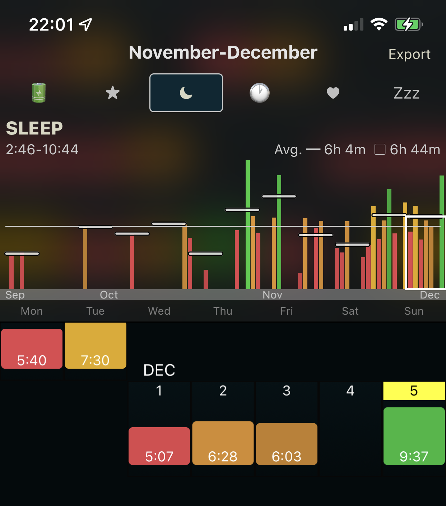

# 2021-12-05

# 2021-12-02~04 까지는?

## 2021-12-02

- 너무 힘든 날이라서 퇴근 후 바로 잠을 잤다.

## 2021-12-03

- 힘든 날은 아니었지만, 공부 외적으로 해야 할 것들이 많아서 별도의 공부는 하지 않았다.

## 2021-12-04

- 뭔가 방전이 된 것처럼 뻗어버렸다. 잠 자체는 충분히 자기는 했지만, 그냥 심신이 지쳐있던 거 같다. 운동도 하지 않았다.

---

# 오늘 한 일

## leetcode 문제 풀기

- 주중에는 시간이 바쁘다는 이유로 손을 대지 못 했던 알고리즘을 한 문제 풀었다.
    - 다만, easy 문제였다. 별도의 알고리즘이 필요 없어도 풀 수 있는 쉬운 문제였다는 점...

## 그 외에는

- 진짜 잠만 자고, 아무것도 안 했다. 진짜 '아무것도 안 하기' 를 정말 충실하게 수행했다.

---

# 생활 패턴 돌아보기

## 너무 적은 수면

- 평일 수면이 너무 적다보니, 주말에 죽어라 몰아서 잠을 잔다는 생각이 들었다. 주중 동안 컨디션이 그렇게 썩 좋지 않았고, 업무에만 영향을 미치는 게 아니라 주말에도 영향을 미치는 거 같다.
- 그런 수면시간에도 불구하고 경조사 참석 / 잠시 친구들을 만나서 물건을 전달해 주는 일들 / 출퇴근 공부를 소화해 내다보니 스스로가 완전히 지쳐버린 거 같다.
    - 꾸준히 하고, 편한 마음으로 출근/퇴근을 한 뒤, 편하게 주말에도 일어나 아무 일이 없던 것처럼 공부를 해야하는데, 위의 이유로 지쳐버린 게 아닐까 생각한다.

## 이번 주 수면시간 돌아보기

- 화요일에 있던 저 7시간 30분 수면은, 중간에 점심시간에 가서 거의 1시간 30분을 자고 온 것까지 포함한 것이다.
- 목요일의 6시간 28분 수면 또한, 퇴근하고 나서 스터디를 들어가기 전 1시간 정도 로비에서 뻗어있던 시간을 포함한 것이다.
- 토요일은 시계를 차고 자지 않아서 확인되지 않았지만, 거의 10시간 정도를 잤다.
- 5시간 40분 / 6시간 00분 / 5시간 07분 / 5시간 28분 / 6시간 03분 / 10시간 / 9시간 37분
    - 주중 only 평균수면시간: 5시간 40분
    - 주말 포함 평균수면시간:  6시간 49분

## 다음 주의 수면 계획

- [대한수면학회의 '정상수면' 게시글을 참고했다.](https://www.sleepnet.or.kr/sleep/normal#:~:text=%EB%B9%84%EB%A0%98%EC%88%98%EB%A9%B4%EC%9D%80%20%EC%96%95%EC%9D%80%20%EC%88%98%EB%A9%B4,%EB%A5%BC%20%ED%95%98%EB%A3%BB%EB%B0%A4%EC%97%90%20%EA%B0%80%EC%A7%80%EA%B2%8C%20%EB%90%A9%EB%8B%88%EB%8B%A4.)
    
    > 수면은 빠른 안구운동이 수면중에 빠른 안구운동 수면 또는 렘수면(REM 수면)과 빠른안구운동이 나타나지 않는 비렘수면(non-REM수면)으로 구성되어 있습니다. 렘수면에서는 꿈을 꾸게 되고 이때는 몸을 움직일 수 없어 꿈을 꾸면서도 행동을 직접 하지 않게 만들어 줍니다. 렘수면은 전체수면의 20~25%를 차지하고 비렘수면은 75~80%를 차지합니다.
    > 
    > 
    > 비렘수면은 얕은 수면인 1-2기 수면과 깊은 수면인 3-4기 수면으로 구성되어 있습니다. 아래그림에서 보이는 것처럼 렘수면-비렘수면은 약 90-120분의 주기로 반복되어 정상적으로는 약 5회 정도의 주기를 하룻밤에 가지게 됩니다.
    > 
- rem - non-rem cycle 이 90분에서 120분 주기로 반복된다고 한다. 그래서 수면시간을 90분단위 + 120분 단위로 두고, non-rem sleep 상태에서 일어날 수 있게끔 수면시간을 설계하는 게 가장 괜찮다고 결론을 내렸다.
    - 목표 기상시간: 06시
    - 수면 시간: 450분 ~ 480분
        - 시간 + 분 으로 환산 시, 7시간 30분 ~ 8시간
    - 적정 취침 시간: 22시
- 22시에 일단은 침대에 눕고, 06시에 기상하는 게 가장 괜찮다는 결론을 내릴 수 있었다.
- 22시에 집에 와서 침대에 누우려면, 21시 30분 경에는 집에 도착해야 한다
    - 환복 및 다음 날 출근 준비 등에 30분 정도를 사용하기 때문이다.
- 21시 30분 경에 집에 도착하려면, 헬스를 마치고 버스정류장에 21시 정도에는 나가 있어야 한다
    - 버스가 바로 오지 않고 버스를 기다리는 시간까지 포함하면, 30분 정도를 할당해야 한다.
- 21시에 운동 + 샤워를 종료하려면,
    - 근력운동을 하는 경우 90분 + 30분, 적어도 19시에는 헬스장에 도착해야 한다.
    - 유산소운동만을 하는 경우 30분 + 30분, 적어도 20시에는 헬스장에 도착해야 한다.
- 퇴근하는데는 약 90분 정도 소요가 된다.
    - 근력운동을 하는 경우엔, 17시 30분에 바로 집으로 가야한다.
    - 유산소운동만을 하는 경우엔, 18시 30분에 바로 집으로 가야한다.

## 결론

- 근력운동을 하는 날: 퇴근 하고 나서 바로 집으로 가기
- 유산소운동을 하는 날 : 퇴근 하고, 18시 30분까지 공부를 하다가 바로 집으로 가기
- 고려할 경우들
    - 목요일 사내 Kotlin 스터디:  이 날은 유산소 운동만 한다.
    - 기타 일상에서 생기는 약속들:  Kotlin 스터디와 마찬가지로, 유산소 운동만을 한다.

## 잊지 말아야 할 주중 수면시간을 늘리는 목표

- 이번 주 같이 주말에 방전이 되어버리는 경우를 피하기 위해서임
    - 그렇기 때문에, 부족한 공부를 주말동안 보충하고, 주말동안 운동을 빼먹지 말아야 함

---

# 기타

- 공부를 하지 않는 날에도 TIL 을 써야하나? 고민을 했었는데, TIL 을 쓰기 위해 공부를 하자! 라는 마음가짐이 없다면 의미가 없다고 생각한다.
- 적어도 출퇴근길 공부라도 한 날에야 TIL 을 작성하고, 그마저도 하지 않았다면 그냥 벌금을 내고 쓰지 않는 걸로 하자. 그게 취지에 가깝다고 생각한다.
    - 그래서 이전 행동 (2021-12-02 ~ 2021-12-04 에 TIL 을 작성하지 않은 것)을 후회하진 않는다. 커밋을 위한 커밋이 되어서는 안 된다고 생각하기 때문이다.